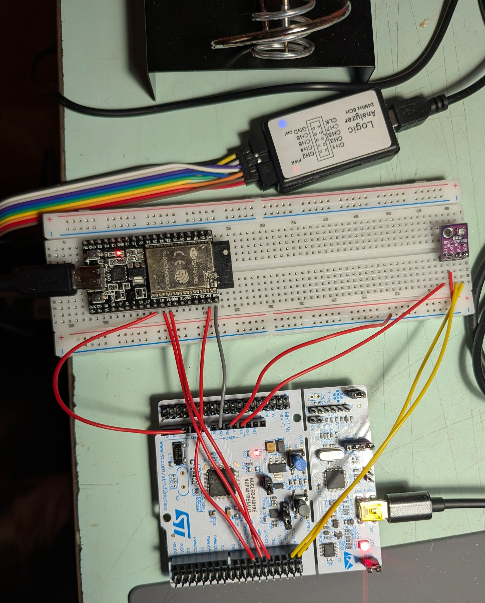
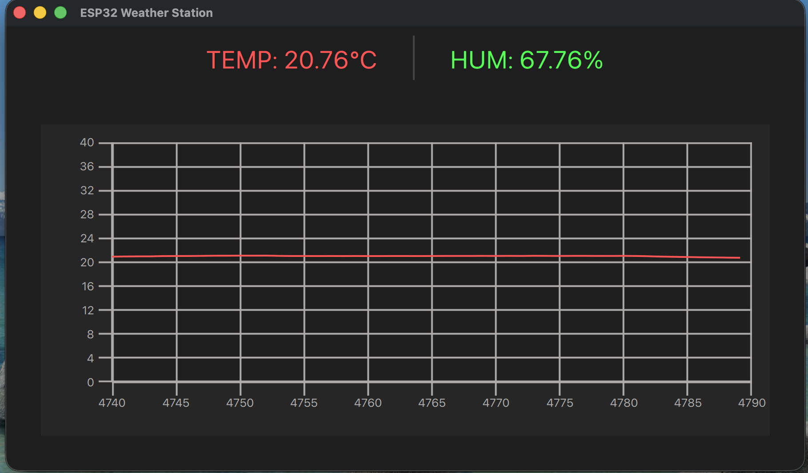

# Multi-Node Weather Monitoring System

A distributed IoT weather station utilizing a high-performance sensor node, a WiFi gateway, and a real-time desktop dashboard.

## 🚀 Overview
This system measures ambient temperature and humidity using a BME280 sensor. Data is transferred to STM32 via I2C, processed, transmitted via SPI to an ESP32, and finally broadcasted over UDP to a Qt-based desktop application.

### Key Features
**STM32 (Slave)**: Low-level I2C sensor drivers and Interrupt-driven SPI for zero-latency data transfer.

**ESP32 (Master/Gateway)**: SPI Master that fetches data and encapsulates it into JSON packets.

**Networking**: UDP broadcast for real-time monitoring on a local network.

**Desktop Client**: Cross-platform Qt/QML interface for data visualization:

## 🏃 How to Run
STM32: Flash using STM32CubeIDE. Ensure SPI1 is set to Slave with Global Interrupts enabled.

ESP32: Open in Arduino IDE/PlatformIO. Update Config::SSID in WeatherProtocol.h.

Desktop: Build the Qt project using Qt Creator (Qt 6.x recommended).

## 📂 Repository Structure
/stm32-sensor-node - STM32 C Source code.

/esp32-gateway - ESP32 Arduino sketches.

/qt-ui - Dashboard UI source.

